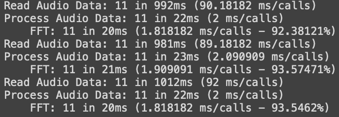

# Presentation
EasyProfile is a cross-platform profiler using .NET Standard 2.0. It runs anywhere you have C# installed. It provides a simple way to profile your code without having to pay for a version of Visual Studio with a .NET profiler. You can use it in two different ways. You can either write the code to profile in a `using` block or between a `Start()` and `Stop()` function.

`using` version:

```c#
using
{
    //Code to profile
}
```

`Start()` and `Stop()` version:
```c#
Start();
//Code to profile
Stop();
```

The profiler also comes with two modes: a *dynamic* mode and a *static* mode.
## Dynamic mode
In the dynamic mode, EasyProfile automatically updates to the Console the statistics of utilisation.

## Static mode
In the static mode, you'll have to call a function when your done profiling your code. The data will be written to a file in a format that makes it possible to be view in any **chromium** browser. You'll simply have to type `chrome://tracing` and load the `json` file generated

**Warning: the static mode is still in development, only the dynamic mode works at the moment**

# How To use
The profiler automatically creates the dependency tree to know in which section it is called. The dependency tree is built the first time of the execution adding a bit of overhead. But after this first building step, the profiler becomes low overhead.

## Dynamic mode
You can profile your code and having results displayed at regular intervals using either of the two methods:

```c#
using (EasyProfile.Profiler.DynamicProfile("Section1 Name"))
{
    /*
        code to profile
    */
}
```

```c#
EasyProfile.Profiler.DynamicStart("Section1 Name");
/*
    code to profile
*/
EasyProfile.Profiler.Stop();
```

The difference between the two methods is that with the `using`, the profiler automatically stops if a return happens in the using block. With the `Start` and `Stop` method you'll have to be sure that for each `Start` call, a `Stop` call is made for each path in the profiled code.

By default, the statistics are displayed on the console each second. You can change this behaviour by calling 
```c#
EasyProfile.Profiler.DynamicTimeInterval = /*time in second (integer)*/
```
Nested sections can be created. While in a using block or after a `Start` call without encountering a `Stop` call, the profiler will create a new section as a child of the current one and they will be indented in the display in the console.

For exemple, this code
```c#
void ProcessAudioData()
{
    using (EasyProfile.Profiler.DynamicProfile("FFT"))
    {
        PerformFFT(/*...*/);
    }
}
//...
using (EasyProfile.Profiler.DynamicProfile("Read Audio Data"))
{
    ReadAudio(/*...*/)
}

//...

using (EasyProfile.Profiler.DynamicProfile("Process Audio Data"))
{
    ProcessAudioData(/*...*/);
}
//...
```

Will display:



**Documentation is still in progress**